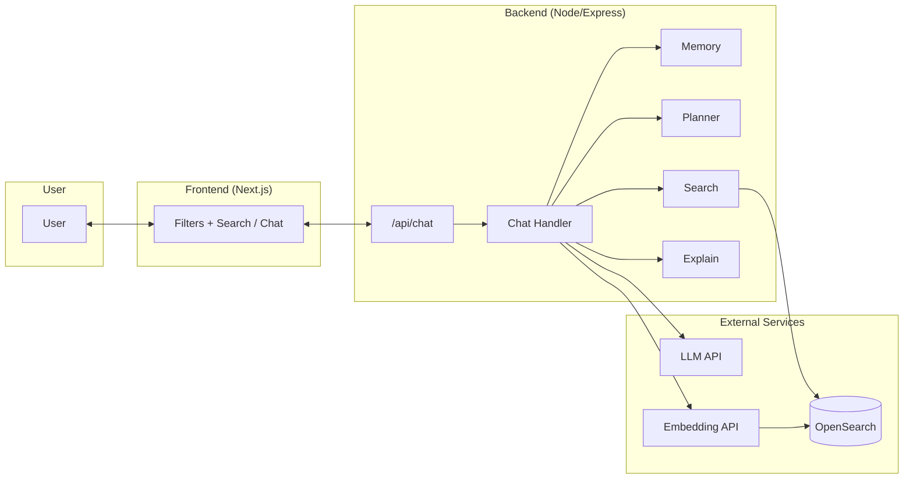
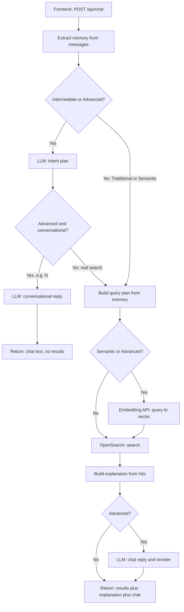
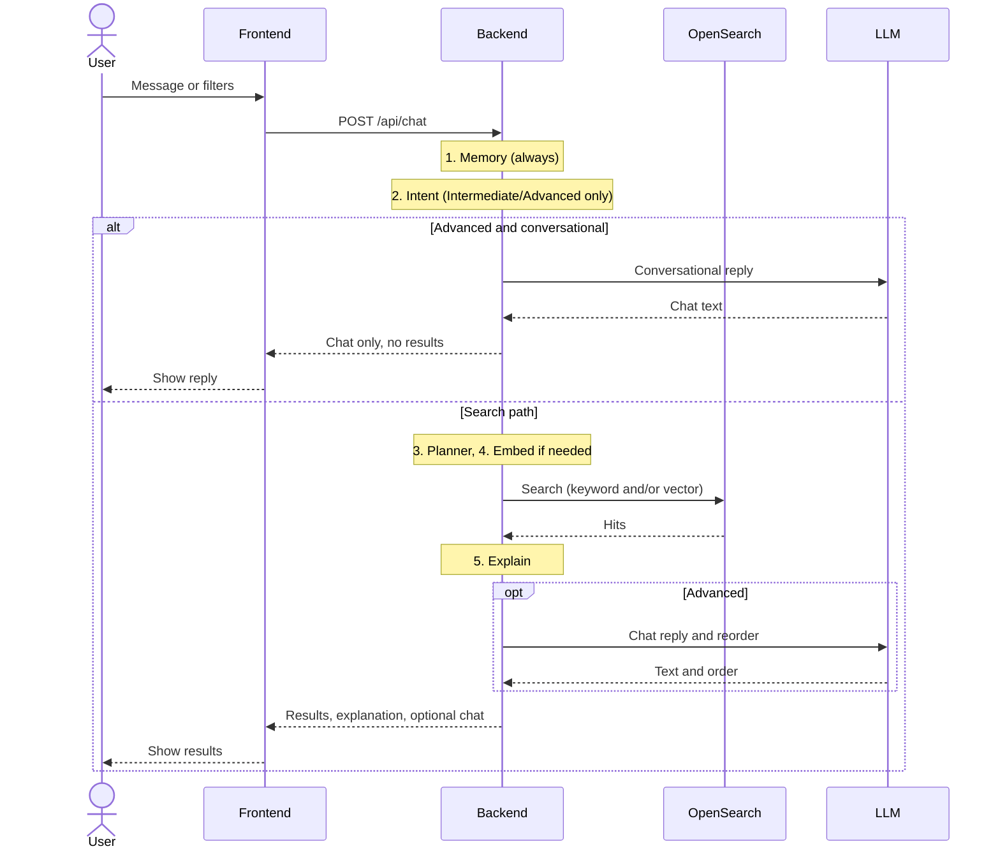

# How the Application Works

This document explains the architecture and data flow of the Next-Gen Location Search app so you can see how each piece fits together.

---

## High-Level Architecture

The app has four main parts: the **frontend** (UI), the **backend** (API and orchestration), **OpenSearch** (search engine), and an optional **LLM/embedding service** (e.g. OpenAI) for semantic and advanced modes.

The **User** interacts with the **Frontend** (filters, keyword box, or chat). The **Frontend** sends a single request to the **Backend** at `POST /api/chat` with mode, messages, and user context (e.g. location). The **Chat Handler** coordinates everything: it calls **Memory**, **LLM** (for intent), **Planner** (to build a query plan), **Search** (to build and run the OpenSearch query), and **Explain** (to build explanation text). **OpenSearch** holds the place index (keyword fields, geo, and optional vectors) and returns ranked hits. The **LLM** and **Embedding** APIs are used only in Semantic, Intermediate, and Advanced modes.

---

## Request Flow (From User Message to Results)

Every request hits the same entry point; the path then depends on **mode** and whether the user is **searching** or just **chatting** (Advanced only).

### Step 1: What path does this request take?

This flowchart shows the decisions the backend makes. Only one path runs per request.

In **Traditional** and **Semantic** we skip LLM intent and go straight to **Build query plan**. In **Intermediate** and **Advanced** the LLM returns an intent; in **Advanced**, if the message is conversational (e.g. "hi"), we return a chat reply and stop (no search). **Build query plan** is where the Planner produces one plan (query, filters, boosts, sort) for the current mode. **Embedding** runs only for Semantic and Advanced; then we call OpenSearch with or without a vector. **OpenSearch** always runs when we're doing a real search (not the conversational shortcut). A **chat reply** is generated only in Advanced after a real search; then we return results, explanation, and chat text.

### Step 2: Who talks to whom (simplified)

This sequence diagram shows the same flow with only the main actors. Internal steps (memory, planner, explain) are grouped inside the Backend.

### Step 3: What each step does

**Memory** extracts entity (e.g. “coffee shop”), attributes (e.g. “quiet”), filters (open now, distance, price), and raw query from the conversation. In Advanced mode the full conversation is used; in other modes only the latest user message.
**Intent** (Intermediate/Advanced) is where the LLM turns the conversation into a structured plan: search query, filters, boosts, sort, and whether this is a search or just chat. If it’s conversational (e.g. “hi”), the backend returns a chat reply and skips search.
**Planner** builds a single **QueryPlan** for the chosen mode: the keyword query, filters, boosts, sort order, and whether to use vector search. For “which one has X” follow-ups, it extracts the criterion (e.g. “students”) and uses it as the query.
**Embedding** (Semantic/Advanced): The plan’s query text is sent to the embedding API; the returned vector is used for kNN in OpenSearch.
**Search** turns the plan into an OpenSearch request (body and sort). The backend runs the search and gets back a list of hits.
**Explain** builds the explanation block (why results matched, filters applied, review snippets).
**Chat response** (Advanced only): the LLM generates a short reply and an optional recommended order; the backend reorders the hit list accordingly.

---

## What Runs in Each Mode

| Step | Traditional | Semantic | Intermediate | Advanced |
|------|-------------|----------|--------------|----------|
| Memory | Last message only | Last message only | Last message only | **Full conversation** |
| LLM intent | No | No | **Yes** | **Yes** (+ conversational check) |
| Planner | Yes (keyword + filters from memory) | Yes (query from memory) | Yes (intent + memory) | Yes (intent + memory + refinement) |
| Embedding | No | **Yes** (required) | No | Yes (optional; fallback to keyword) |
| OpenSearch | BM25 + geo filter | **kNN only** (no geo in query) | BM25 + boosts + geo sort | **Hybrid** (BM25 + kNN) + boosts + geo sort |
| Explain | Yes | Yes | Yes | Yes |
| Chat response | No | No | No | **Yes** (and result reorder) |

**Traditional** uses no LLM and no embedding: keyword and filters come from the left panel or memory, with a hard geo filter and sort by distance. **Semantic** has no LLM intent; the query from memory is embedded and OpenSearch runs kNN only (plus optional filters on openNow/priceTier), with sort by score only (no geo in the query). **Intermediate** uses the LLM for intent but no embedding: BM25 plus filters, boosts, and proximity sort, no kNN. **Advanced** uses full conversation memory, LLM intent, and optional embedding: hybrid query (BM25 + kNN), boosts, proximity sort, then LLM chat response and reordering.

---

## OpenSearch Query Shape by Mode

**Traditional** is keyword search plus a location filter; results are sorted by rating, then distance. **Semantic** is vector (embedding) search only; results by relevance score. **Intermediate** is keyword search with rating and distance boosts; sort by rating, then distance. **Advanced** combines keyword and vector; sort by relevance, then rating, then distance.

---

## Packages and Their Roles

| Package | Role |
|---------|------|
| **types** | Shared TypeScript types: `ChatMessage`, `QueryPlan`, `SearchMode`, `SearchResultHit`, etc. |
| **memory** | Reads the conversation (or last message) and extracts entity, attributes, filters, and raw query. No LLM. |
| **llm** | Calls the LLM: intent plan (query, filters, boosts, isSearchQuery) and, in Advanced, chat reply or conversational reply. |
| **planner** | Builds the **QueryPlan** for the current mode: combines memory, optional intent, and last user message; handles “which one X” by extracting the criterion. |
| **search** | Builds the OpenSearch request body from the plan (and size, location, optional vector) and runs the search. |
| **explain** | Builds the explanation block (why it matched, filters applied, review snippets, warnings) from the top hits and the plan. |

The **backend** ties them together: it calls memory → (optional) LLM → planner → (optional) embed → search → explain → (optional) LLM chat, then returns results, explanation, query plan, and optional chat text to the **frontend**.

---

## Where to Go Next

[Demo queries](./demo-queries.md) has example flows for each mode. The [README](../README.md) covers setup and usage. [VECTOR_DATABASE_COMPARISON.md](../VECTOR_DATABASE_COMPARISON.md) explains why we use OpenSearch versus other vector/search solutions.
