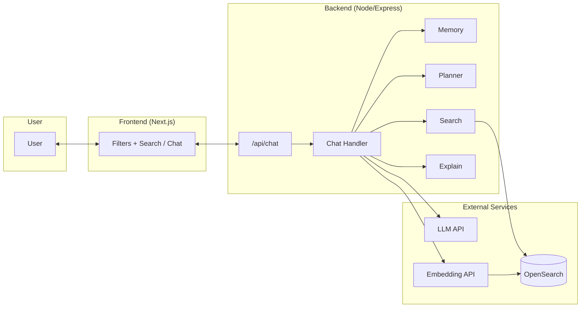
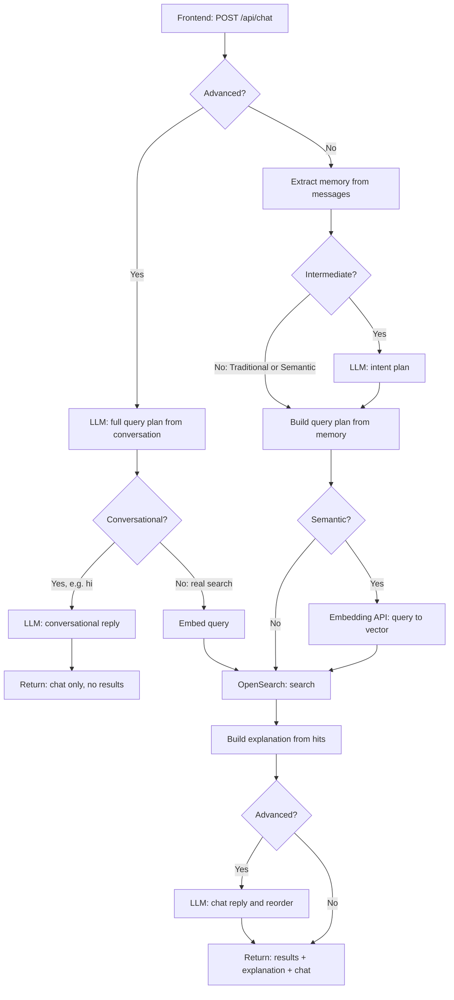
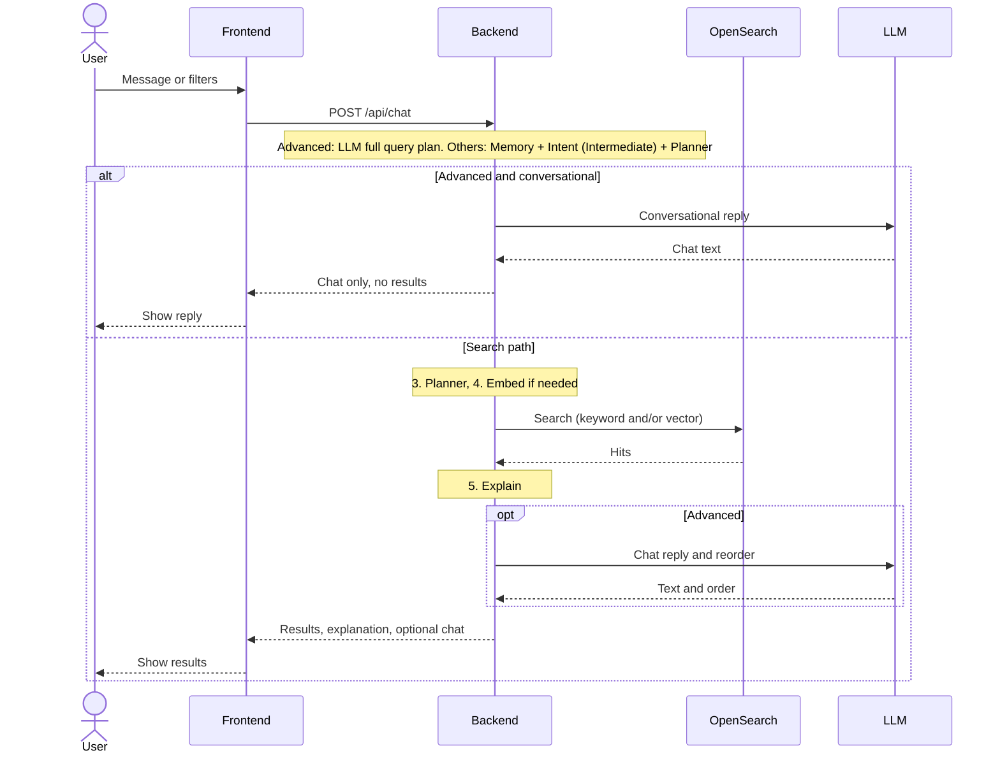

# How the Application Works

This document explains the architecture and data flow of the Next-Gen Location Search app so you can see how each piece fits together.

---

## High-Level Architecture

The app has four main parts: the **frontend** (UI), the **backend** (API and orchestration), **OpenSearch** (search engine), and an optional **LLM/embedding service** (e.g. OpenAI) for semantic and advanced modes.

The **User** interacts with the **Frontend** (filters, keyword box, or chat). The **Frontend** sends a single request to the **Backend** at `POST /api/chat` with mode, messages, and user context (e.g. location). The **Chat Handler** coordinates everything. In **Traditional**, **Semantic**, and **Intermediate** it uses **Memory** and (for Intermediate) **LLM intent** plus **Planner** to build a query plan. In **Advanced** the **LLM** receives the full conversation and produces the **query plan directly** (query, filters, review terms, sort); Memory and Planner are only used as a fallback if the LLM call fails. **Search** turns the plan into an OpenSearch request and runs it; **Explain** builds the explanation text. **OpenSearch** holds the place index (keyword fields, geo, and optional vectors) and returns ranked hits. The **LLM** and **Embedding** APIs are used in Semantic, Intermediate, and Advanced modes.

---

## Request Flow (From User Message to Results)

Every request hits the same entry point; the path then depends on **mode** and whether the user is **searching** or just **chatting** (Advanced only).

### Step 1: What path does this request take?

This flowchart shows the decisions the backend makes. Only one path runs per request.

**Advanced** uses a different path: the LLM receives the full conversation and returns a complete **query plan** (query, filters, review terms, sort). No memory extraction or Planner step in the success path; those are only used if the LLM call fails. If the LLM says the turn is conversational (e.g. "hi"), we return a chat reply and stop. Otherwise we embed the plan’s query, run OpenSearch (hybrid BM25 + kNN), build the explanation, then generate a chat reply and reorder results.

**Traditional**, **Semantic**, and **Intermediate** all use **Extract memory** and (for Intermediate) **LLM intent plan**; the **Planner** builds one query plan from memory and optional intent. **Embedding** runs for Semantic and for Advanced; OpenSearch then runs with the plan. A **chat reply** is generated only in Advanced after a real search.

### Step 2: Who talks to whom (simplified)

This sequence diagram shows the same flow with only the main actors. Internal steps (memory, planner, explain) are grouped inside the Backend.

### Step 3: What each step does

**Advanced path (LLM query plan):** The LLM receives the full conversation and user location and returns a complete **QueryPlan** (query keywords, filters, mustHaveFromReviews, boosts, sort). The backend uses this plan directly—no separate Memory or Planner step. If the LLM flags the turn as conversational (e.g. "hi"), the backend returns a chat reply and skips search. If the LLM call fails, the backend falls back to Memory + Intent + Planner as in Intermediate.

**Memory** (Traditional, Semantic, Intermediate, and Advanced fallback): Extracts entity (e.g. “coffee shop”), attributes (e.g. “quiet”), filters (open now, distance, price), and raw query. In Intermediate, last message only; in Advanced fallback, full conversation.
**Intent** (Intermediate only; Advanced uses full query plan): The LLM turns the user message into a structured intent (query, filters, boosts, sort). The Planner merges this with memory to build the QueryPlan.
**Planner** (Traditional, Semantic, Intermediate, and Advanced fallback): Builds a **QueryPlan** from memory and (for Intermediate) LLM intent. Not used in Advanced when the LLM returns a plan directly.
**Embedding** (Semantic/Advanced): The plan’s query text is sent to the embedding API; the returned vector is used for kNN in OpenSearch.
**Search** turns the plan into an OpenSearch request (body and sort). The backend runs the search and gets back a list of hits.
**Explain** builds the explanation block (why results matched, filters applied, review snippets).
**Chat response** (Advanced only): the LLM generates a short reply and an optional recommended order; the backend reorders the hit list accordingly.

---

## What Runs in Each Mode

| Step | Traditional | Semantic | Intermediate | Advanced |
|------|-------------|----------|--------------|----------|
| Memory | Last message only | Last message only | Last message only | Fallback only (if LLM fails) |
| LLM | No | No | **Intent plan** (one message) | **Full query plan** (entire conversation) |
| Planner | Yes (keyword + filters from memory) | Yes (query from memory) | Yes (intent + memory) | Fallback only (if LLM fails) |
| Embedding | No | **Yes** (required) | No | Yes (query from plan) |
| OpenSearch | BM25 + geo filter | **kNN only** | BM25 + boosts + geo sort | **Hybrid** (BM25 + kNN) + review boosts + geo filter |
| Explain | Yes | Yes | Yes | Yes |
| Chat response | No | No | No | **Yes** (and result reorder) |

**Traditional** uses no LLM and no embedding: keyword and filters come from the left panel or memory, with a hard geo filter and sort by distance. **Semantic** has no LLM; the query from memory is embedded and OpenSearch runs kNN only (plus optional filters), with sort by score. **Intermediate** uses the LLM for an intent plan (one message) and the Planner to build the QueryPlan; BM25 plus filters, boosts, and proximity sort. **Advanced** sends the full conversation to the LLM, which returns a complete QueryPlan (query, filters, review terms, sort); the backend uses it directly with hybrid search (BM25 + kNN), review-based ranking, and a hard geo filter. Memory and Planner are only used if the LLM call fails. After search, the LLM generates a chat reply and can reorder results.

---
